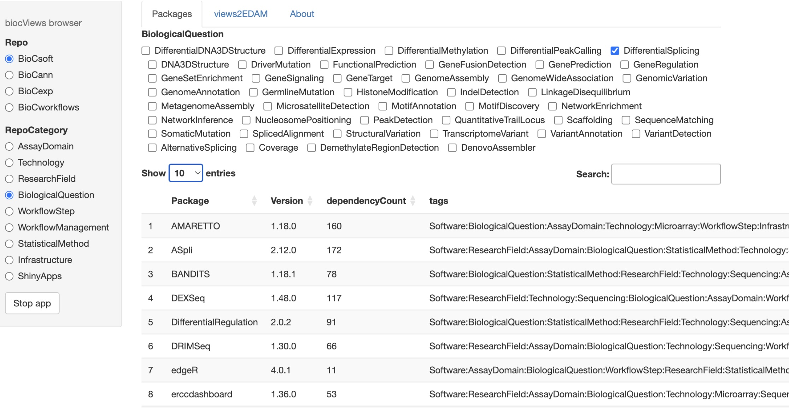
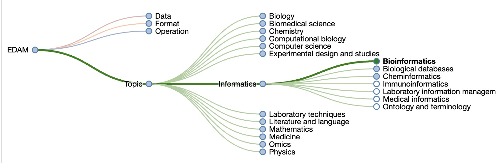
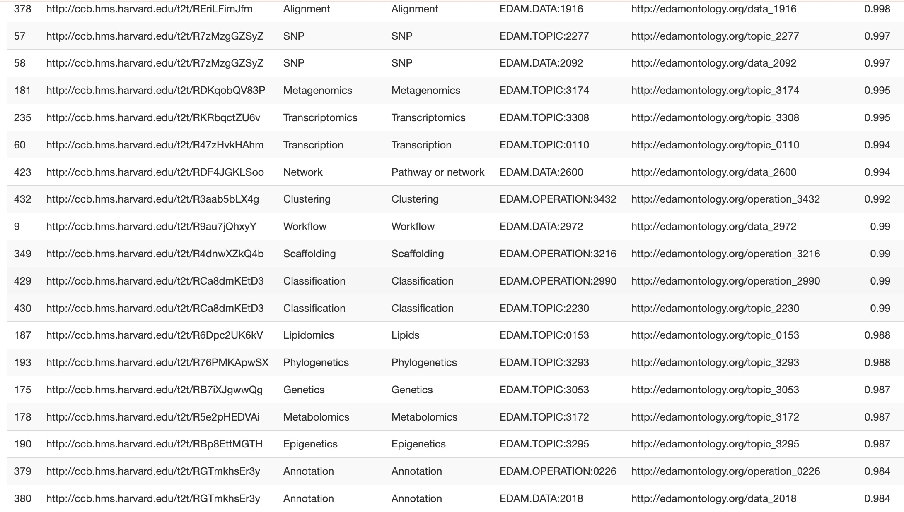
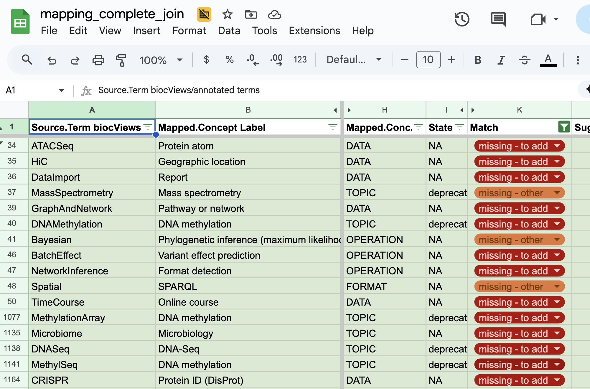
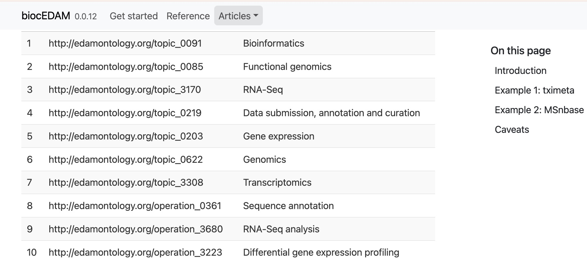
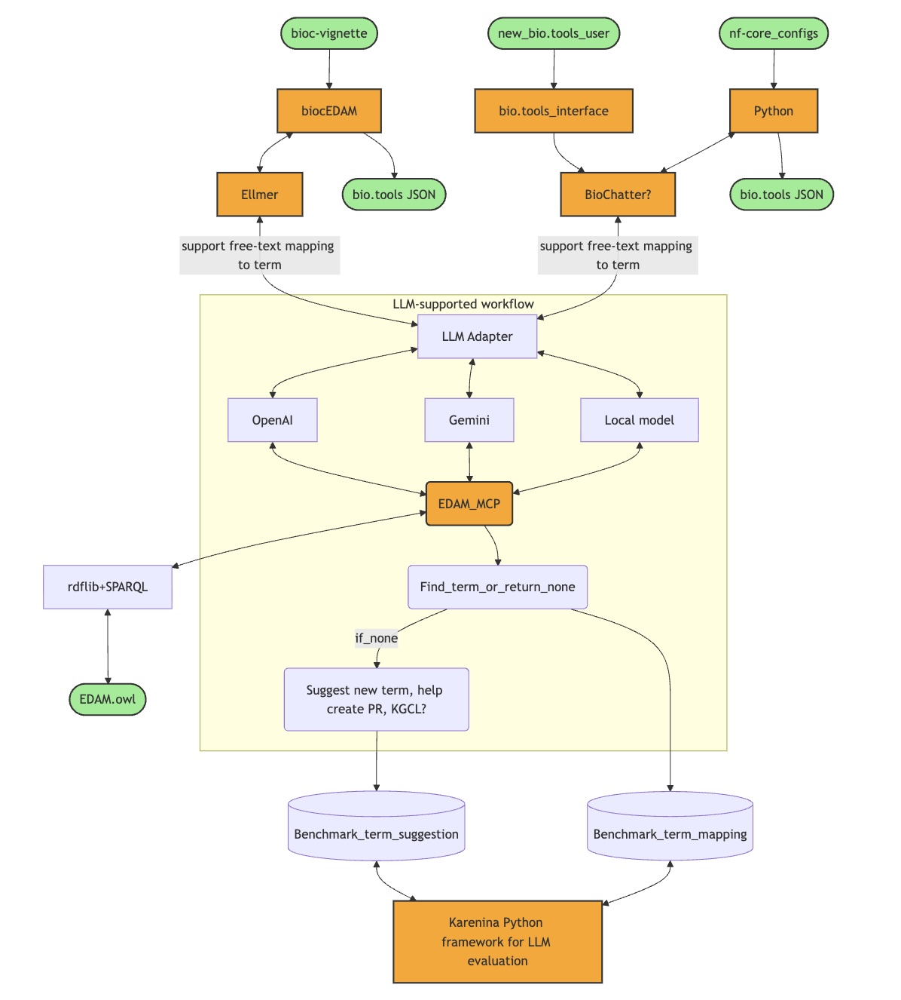

```{r setup, include=FALSE}
library(tufte)
# invalidate cache when the tufte version changes
knitr::opts_chunk$set(tidy = FALSE, cache.extra = packageVersion('tufte'))
options(htmltools.dir.version = FALSE)
suppressPackageStartupMessages({
library(BiocStyle)
library(biocEDAM)
library(ggplot2)
})
```

# Bioconductor and biocViews

biocViews is a package that started with the ambition 
of emulating CRAN Task Views.  It wound up as a 'graph' object.
Every Bioconductor package must tag itself in the DESCRIPTION
file with one or more terms.



# EDAM and the ELIXIR Research Software Ecosystem

The EDAM ontology is registered at the National Center for Biomedical Ontology
and has an OWL serialization.



\pagebreak

EDAM is the fundamental vocabulary for organizing the ELIXIR Research Software Ecosystem.

# Adequacy of EDAM for tagging Bioconductor packages

Several approaches to "matching" terms in biocViews to EDAM have been undertaken.



Some gaps that need to be filled:



\pagebreak

# AI-oriented approaches to tagging software resources

With EOSS support, this group has been meeting regularly to create
tools to enhance discoverability of software tools for genomics.

The EDAM vocabulary was distilled to JSON schemas by Anh Nguyet Vu, and
GPT-4 was prompted to use these schemas and to digest package documentation
for the purpose of recommending EDAM terms as package tags.



See Figure 6 for additional work in this direction.

# Beyond packages and modules: fostering workflow composition and use

Software packages are often used in sequential combinations.
The EDAM vocabulary includes precise terms for data formats and operations.
Effective tagging of package components, including data classes and
detailed analytic operations in use,
will be helpful for building reliable analytic workflows.

Figure 6 presents a schematic for harvesting information from
Bioconductor, ELIXIR bio.tools, and nf-core to both
enrich EDAM and to enhance the metadata about software and
workflow ecosystems.





